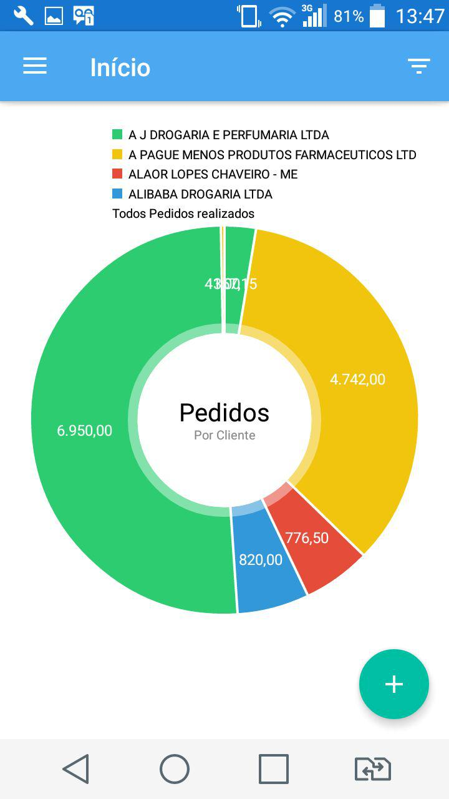
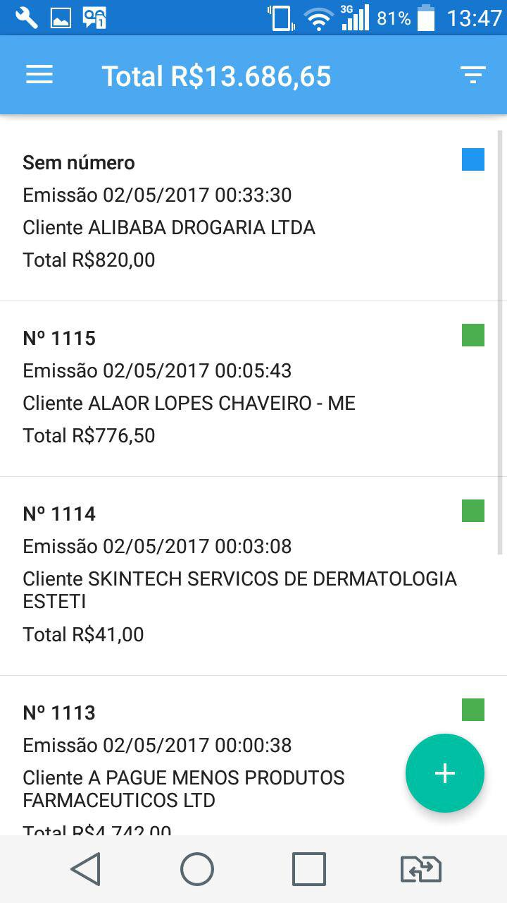
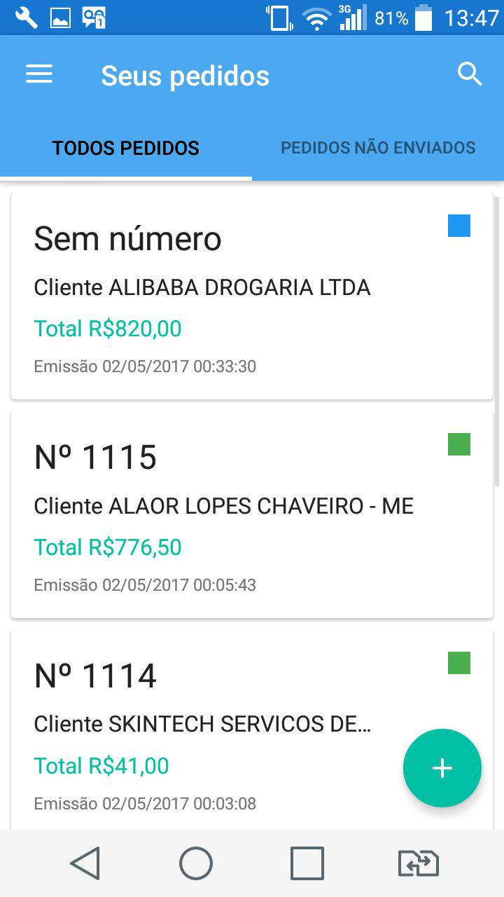
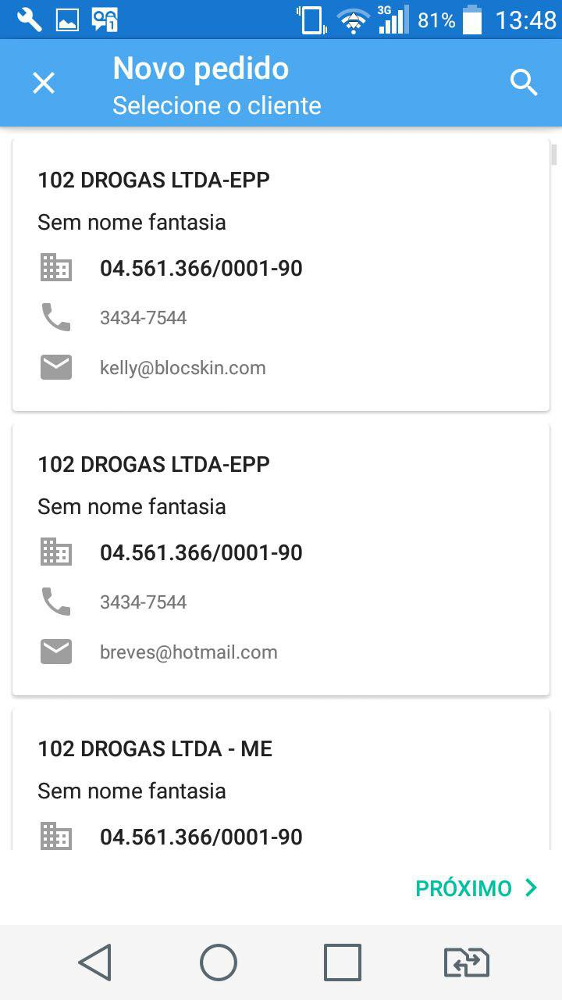
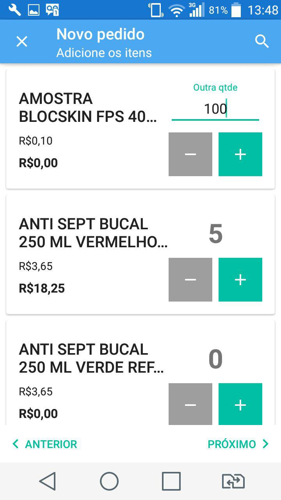

# LibertVendas

Aplicativo móvel de Força de vendas para Android da empresa Libert Solutions.

[Baixe o app](https://github.com/filipebezerra/LibertVendas/releases/download/v1.0.3/LibertVendas-1.0.3-release.apk)

# Capturas de tela

# O que faz este aplicativo?

É um aplicativo que conecta vendedores com as empresas para as quais vendem seus produtos. É possível realizar as vendas e acompanhar o montante de vendas tendo acesso a gráfico e relatório.

# O que há de novo

Consulte a página CHANGELOG do projeto para uma lista de versões com seu log de mudanças.

### [Veja Log de mudanças](https://github.com/filipebezerra/LibertVendas/blob/master/CHANGELOG.md)

Se você assistir a este repositório, GitHub irá enviar-lhe um e-mail cada vez que publicar uma atualização.
